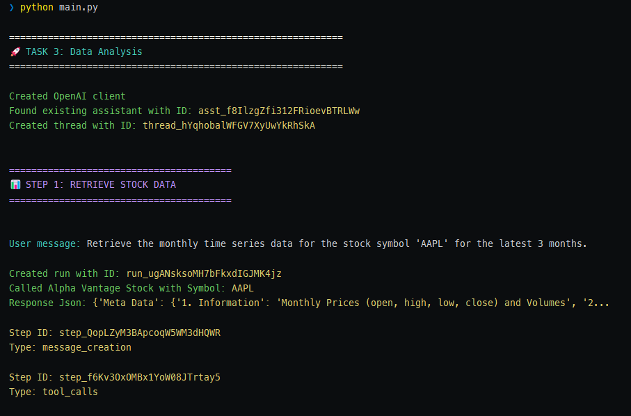
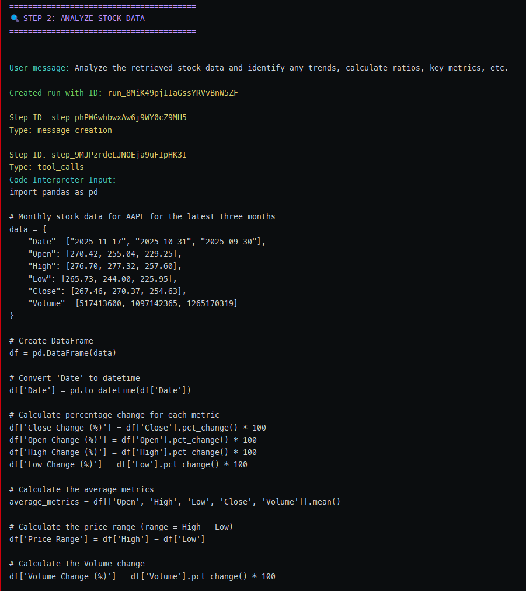
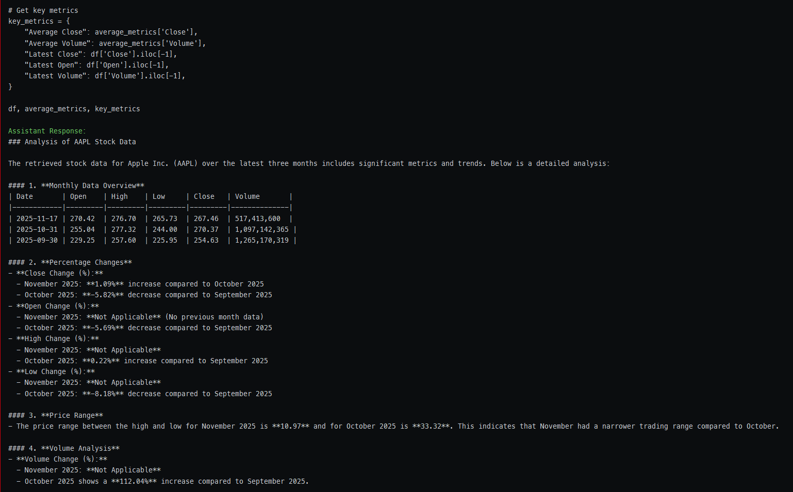
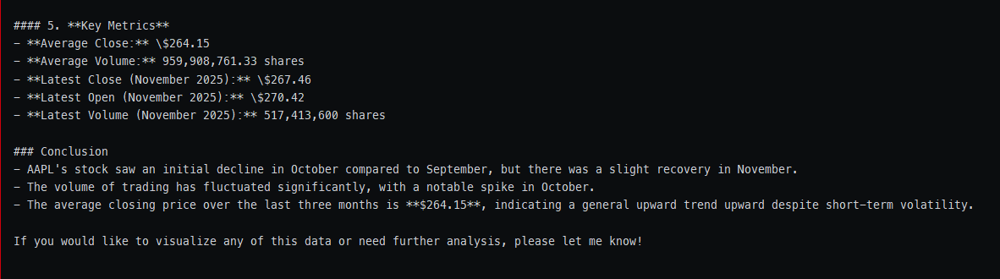
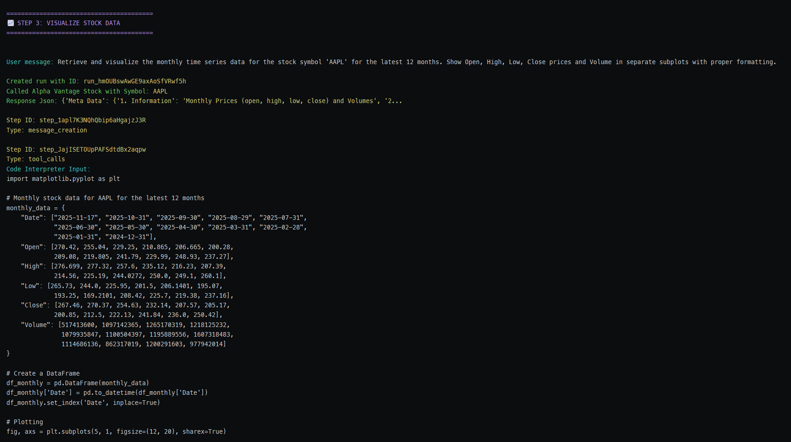
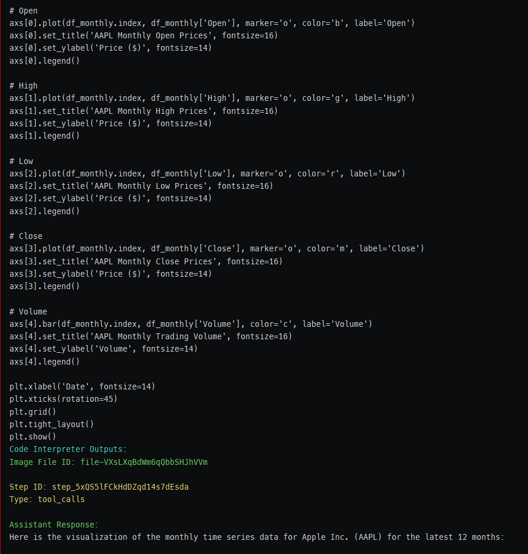
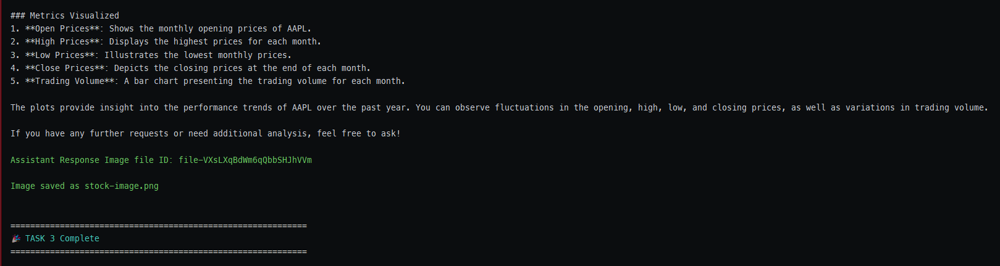

# 📊 Stock Market Analyzer with AI

<div align="center">
   
</div>

<div align="center">
   
   
   
   
</div>

An intelligent stock market analysis assistant powered by OpenAI's GPT-4 and Alpha Vantage API. This application
demonstrates advanced AI capabilities including function calling, code interpretation, and automated
data visualization.

## ✨ Features

- 📈 **Real-time Stock Data Retrieval**: Fetch intraday, daily, weekly, and monthly stock market data
- 🤖 **AI-Powered Analysis**: Automatic trend identification, ratio calculations, and key metrics analysis
- 📊 **Automated Visualization**: Generate professional charts showing Open, High, Low, Close prices
- 🔧 **Function Calling**: Intelligent tool orchestration for seamless data retrieval
- 💻 **Code Interpreter**: Dynamic Python code execution for advanced analytics
- 🎯 **Smart Error Handling**: Robust timeout logic and exception management
- 🎨 **Beautiful CLI Output**: Color-coded output with emojis for enhanced UX

## 🛠️ Technologies Used

- **Python 3.13**
- **OpenAI API** (GPT-4 with Assistants API)
- **Alpha Vantage API** for stock market data
- **Code Interpreter** for data analysis and visualization
- **Matplotlib** (via Code Interpreter) for chart generation
- **python-dotenv** for environment management
- **Colorama** for terminal colors

## 📋 Prerequisites

- Python 3.13 or higher
- OpenAI API key ([Get one here](https://platform.openai.com/api-keys))
- Alpha Vantage API key ([Get one here](https://www.alphavantage.co/support/#api-key))

## 🚀 Installation

1. **Clone the repository**
   ```bash
   git clone https://github.com/gabrielizalo/stock-analyzer.git
   cd stock-analyzer
   ```

2. Create a virtual environment (recommended)
   ```bash
   python -m venv venv
   ```

   **On Windows**
   ```bash
   venv\Scripts\activate
   ```

   **On macOS/Linux**
   ```bash
   source venv/bin/activate
   ```

3. Install dependencies
   ```bash
   pip install -r requirements.txt
   ```

4. Set up environment variables

   **Copy the example file**
   ```bash
   cp .env.example .env
   ```

   Edit .env and add your API keys:

   `OPENAI_API_KEY=sk-your-actual-key-here`

   `BASE_URL=https://api.openai.com/v1`

   `ALPHAVANTAGE_API_KEY=your-alpha-vantage-key`

## 💻 Usage

Run the stock analyzer:

```bash
python main.py
```

The application will automatically:

1. 🚀 Retrieve `AAPL` stock data for the last 12 months
2. 🔍 Analyze trends, ratios, and key metrics
3. 📈 Generate and save visualizations as stock-image.png

Example output:

<div align="left">
   
</div>
<div align="left">
   
</div>
<div align="left">
   
</div>
<div align="left">
   
</div>
<div align="left">
   
</div>
<div align="left">
   
</div>
<div align="left">
   
</div>

Generated visualization:

<div align="center">
   
</div>

## 🏗️ Project Structure

```bash
stock-analyzer/
├── config/
│ ├── __init__.py
│ ├── constants.py           # Application constants and enums
│ └── settings.py            # Environment variable management
├── images/
│ └── stock-image.png        # Generated visualization
├── services/
│ ├── assistant_service.py   # OpenAI Assistant creation and management
│ ├── openai_client.py       # OpenAI client initialization
│ ├── stock_service.py       # Alpha Vantage API integration
│ ├── thread_service.py      # Thread and run management
│ └── workflow_service.py    # Workflow orchestration
├── main.py                  # Application entry point
└── main_helpers.py          # UI/presentation helpers
```

## 🧠 Key Concepts Demonstrated

### Task 1: Assistant Setup

- OpenAI Assistants API integration
- Thread and message management
- Environment configuration and security
- Error handling and exception management

### Task 2: Function Calling

- Custom function definitions for stock data retrieval
- Alpha Vantage API integration
- Tool call handling and response formatting
- Multi-parameter function schemas

### Task 3: Data Analysis

- Code Interpreter tool integration
- Run step monitoring and output display
- Analytical prompt engineering
- Multi-tool assistant configuration

### Task 4: Data Visualization

- Image file generation and retrieval
- Binary file handling
- Mixed content type processing (text + images)
- Visualization prompt engineering

## 🎯 Advanced Features

- Type Hints: Comprehensive type annotations throughout the codebase
- Centralized Configuration: Single source of truth for environment variables
- Timeout Protection: Prevents infinite loops in run polling
- Graceful Error Recovery: Exceptions are properly raised and handled
- Modular Architecture: Clean separation of concerns across services

## 🎓 About This Project

This project was developed as part of the **[AI Engineer Bootcamp](https://go.hyperskill.org/ai-engineer-bootcamp)**
curriculum, demonstrating advanced skills in:

- Working with OpenAI Assistants API
- Implementing multi-tool AI systems
- Integrating external APIs (Alpha Vantage)
- Code Interpreter for dynamic analysis
- Building production-ready AI applications

## 📊 Sample Analysis Output

The AI assistant provides comprehensive analysis including:

- Trend Analysis: Identifies upward/downward price movements
- Volatility Metrics: Calculates price ranges and fluctuations
- Volume Analysis: Tracks trading activity patterns
- Key Ratios: Computes relevant financial metrics
- Visual Insights: Generates multi-metric charts

## 📝 License

This project is open source and available under the [MIT LICENSE](./LICENSE.txt).

## 👤 Author

**Gabriel Porras**

- GitHub: https://github.com/gabrielizalo
- LinkedIn: https://linkedin.com/in/gabrielizalo

## 🙏 Credits

- Stock data provided by https://www.alphavantage.co/
- AI capabilities powered by https://openai.com/
- Header photo by [Anne Nygård](https://unsplash.com/@polarmermaid)
  on [Unsplash](https://unsplash.com/photos/a-close-up-of-a-screen-tcJ6sJTtTWI?utm_source=unsplash&utm_medium=referral&utm_content=creditCopyText)
